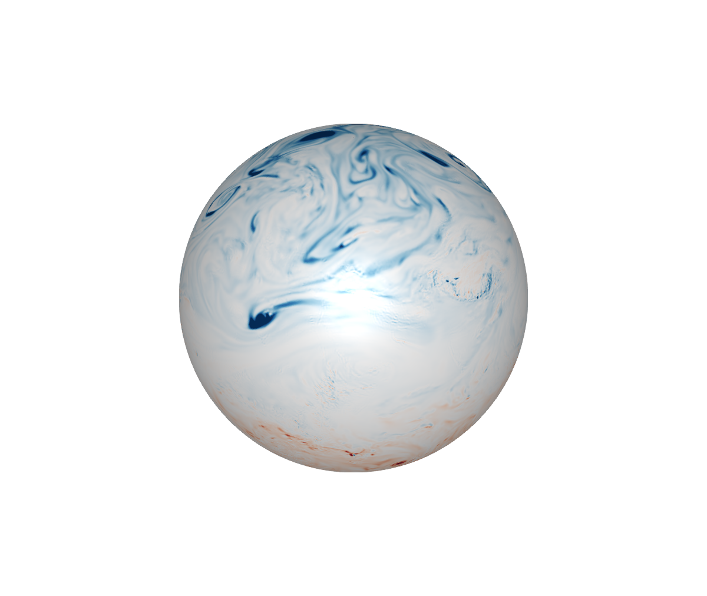
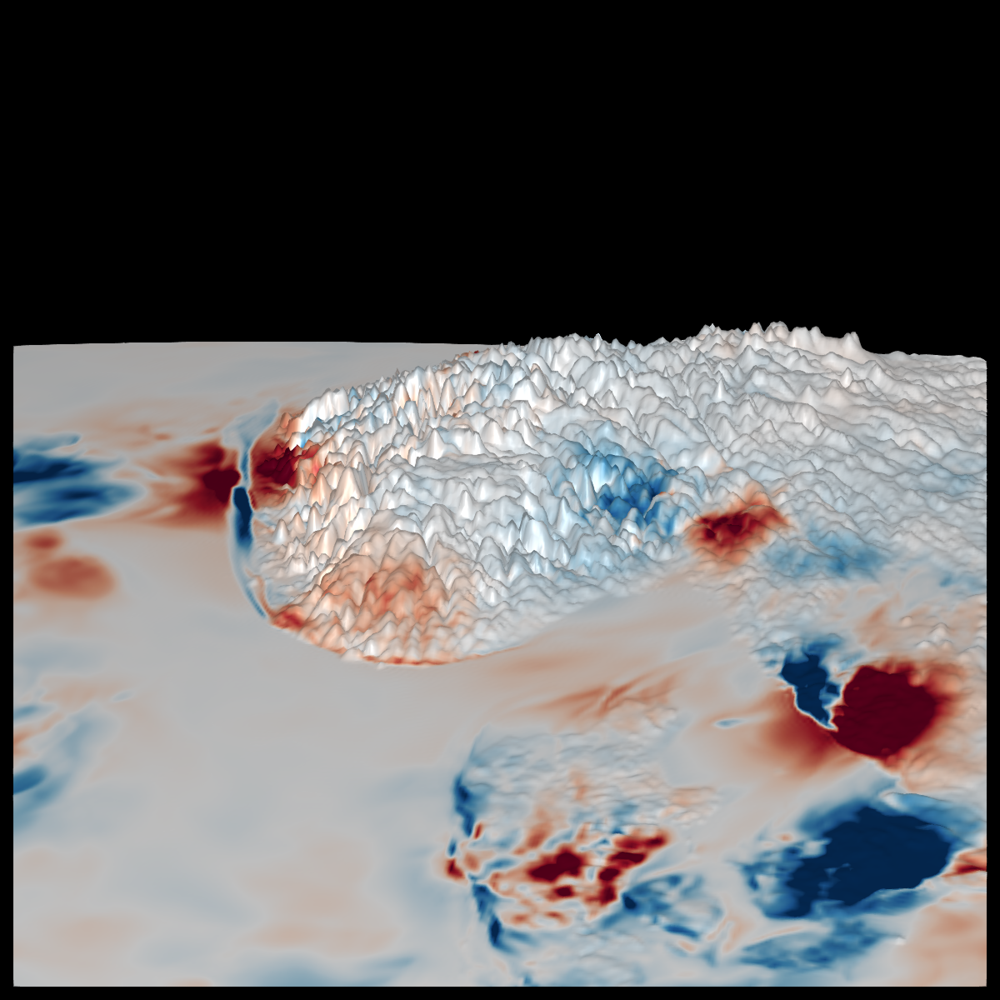

# Examples


These examples use NetCDF files from the `docs/src/assets` directory. For the animations download larger datasets as exlained in the Getting data section. 


## ERA5 potential vorticity 

```julia   
using NCPlots, GLMakie, NCDatasets
ds = Dataset("assets/era5_pv_z_500hPa.nc")
pv = view(ds, time=1)["pv"]
fig, ax, plt = plot(pv, colormap=:RdBu, colorrange=(-3e-6,3e-6))
save("assets/era5_pv_docs.png", fig) # hide
```

 


## Control light

Access properties `specular` `diffuse` etc. in the returned `plt`.


Explain how to update camera, change lightposition  

## Mutliple plots in single axis 

See `docs/plotlogo.jl` for an example 


## Plot on geopotential height surface 

Multiply `x`, `y`, `z` by geopotential height 


## Plot on orography

See plot geopotential height. Color show temperature increments from data assimilation  

 


## CARRA 


## Metcoop

```julia
archive="/lustre/storeB/immutable/archive/projects/metproduction/MEPS/"
ds = Dataset("$archive/2023/10/01/meps_det_2_5km_20231001T00Z.nc")
field = view(ds,hybrid=65,time=1)["air_temperature_ml"]
plot(field)
```


 


## Animated plots

To make these animations use Observables and `@lift` to lift the dataset view e.g.

```julia 
ds = Dataset(...) 
t = Observable(1)
pv = @lift(view(ds,time=$t)["pv"]) 
plot(pv) 
```

Updating `t` wil update the plot e.g.

```julia
for i=1:100
   t[] = i
   sleep(0.01)
end 
```


You can access eyeposition in `ax.scene` and update in the for loop  


