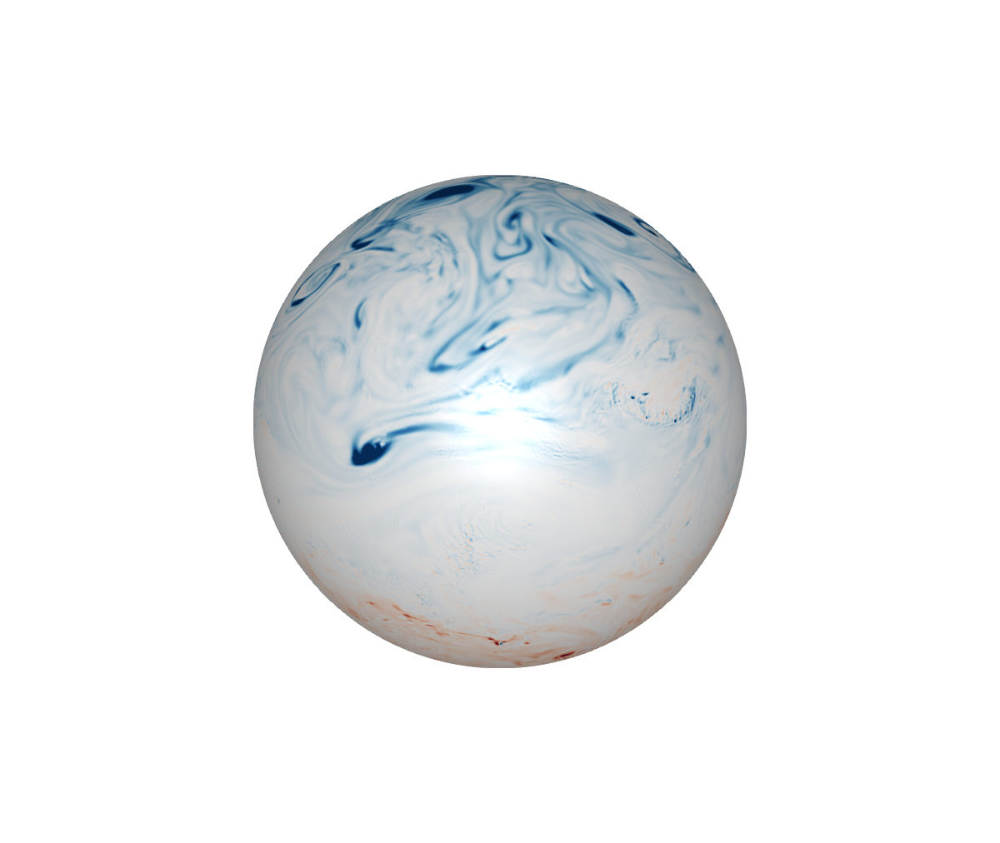

# [Example](@id example) 


These examples use NetCDF files from the `docs/src/assets` directory. For the animations download larger datasets as exlained in the Getting data section. 


## ERA5 potential vorticity 

```julia   
using NCPlots, GLMakie, NCDatasets
ds = Dataset("assets/era5_pv_z_500hPa.nc")
pv = view(ds, time=1)["pv"]
fig, ax, plt = plot(pv, colormap=:RdBu, colorrange=(-3e-6,3e-6))
save("assets/era5_pv_docs.png", fig) # hide
```

 
