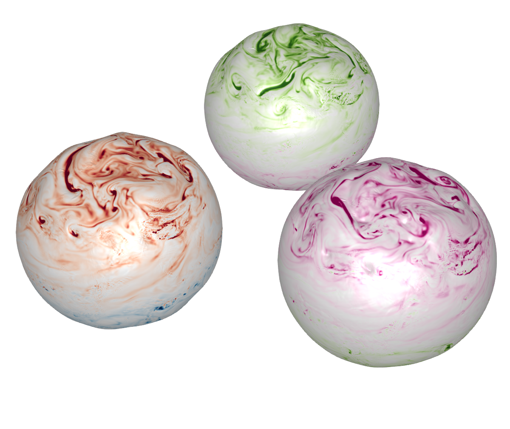

# Plot on geopotential height surface 

Multiply `x`, `y`, `z` by geopotential height 

## Plot on orography

See plot geopotential height. Color show temperature increments from data assimilation  

 

