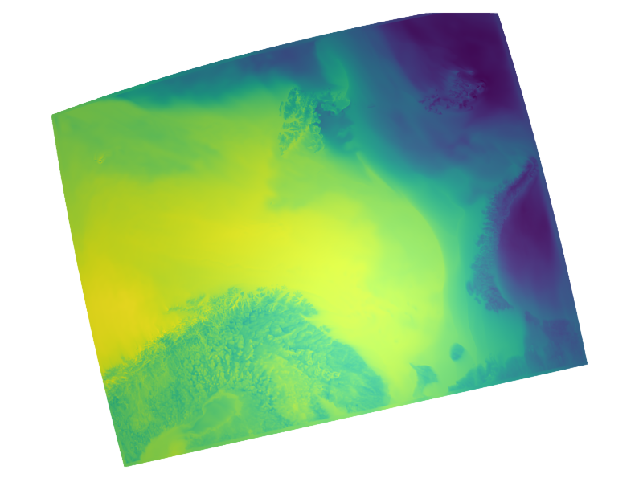

# Limited area plots

## CARRA 





## Metcoop

```julia
archive="/lustre/storeB/immutable/archive/projects/metproduction/MEPS/"
ds = Dataset("$archive/2023/10/01/meps_det_2_5km_20231001T00Z.nc")
field = view(ds,hybrid=65,time=1)["air_temperature_ml"]
plot(field)
```


 

