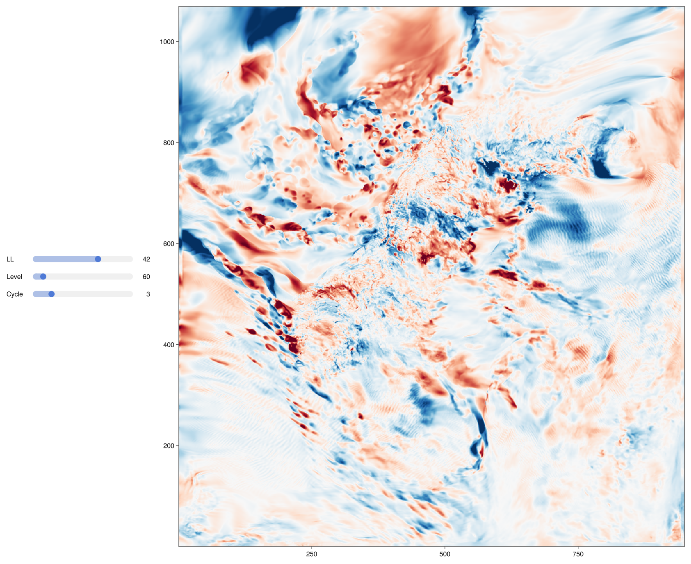

# Metcoop 

Example reading from MEPS archive at MET Norway  

```julia
using Glob, NCDatasets, NCPlots, GLMakie

archive="/lustre/storeB/immutable/archive/projects/metproduction/MEPS/2023/01/30"

files = glob("meps_det_2_5km*.nc", archive)   # use e.g.  "....*00.nc" to only match files with 00:00 UTC

ds = NCDatasets.Dataset(files, aggdim="cycle", isnewdim=true, constvars=["x","y","hybrid","time"],deferopen=false) 

fig = Figure() 
fcint = 3; llmax=66; nlev=65


slg = SliderGrid(fig[1,1], 
  (label="LL",range=1:(llmax-fcint),startvalue=1), 
  (label="Level",range=nlev:-1:1,startvalue=nlev),
   (label="Cycle",range=2:length(files),startvalue=2),
   tellheight=false,
   width=350
)
#Label(fig[1,1],"time",tellwidth=false) # ,rotation=pi/2)
#tsl = Slider(fig[2,1],range=1:(llmax-fcint),startvalue=1) # ,horizontal=false)

#Label(fig[3,1],"Level",tellwidth=false) # $,rotation=pi/2)
#hybrid_sl = Slider(fig[4,1],) # ,horizontal=false)
#Label(fig[5,1],"Cycle") # ,rotation=pi/2)

#cycle_sl = Slider(fig[6,1],range=2:8,startvalue=2) # ,horizontal=false)

ax= Axis(fig[1,2])

varname = "air_temperature_ml"
var = ds[varname]

hybrid_sl = slg.sliders[2]
tsl = slg.sliders[1]
cycle_sl = slg.sliders[3]
dsv = @lift(var[:,:,$(hybrid_sl.value),$(tsl.value),$(cycle_sl.value)] -
            var[:,:,$(hybrid_sl.value),$(tsl.value)+3,$(cycle_sl.value)-1]
            )

label = @lift(string(varname, " Level ",$(hybrid_sl.value)," ", basename(files[$(cycle_sl.value)]), " + ", $(tsl.value)-1, " Hour") )
heatmap!(ax,dsv,colormap=:RdBu,colorrange=(-2,2))
Label(fig[0,:],label,tellwidth=false)

```

